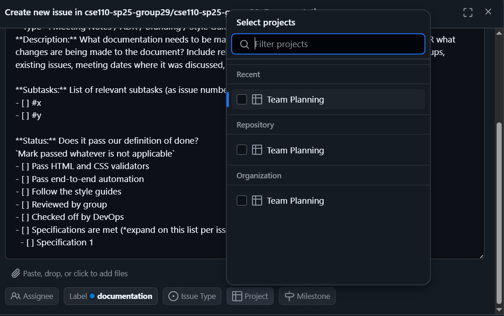
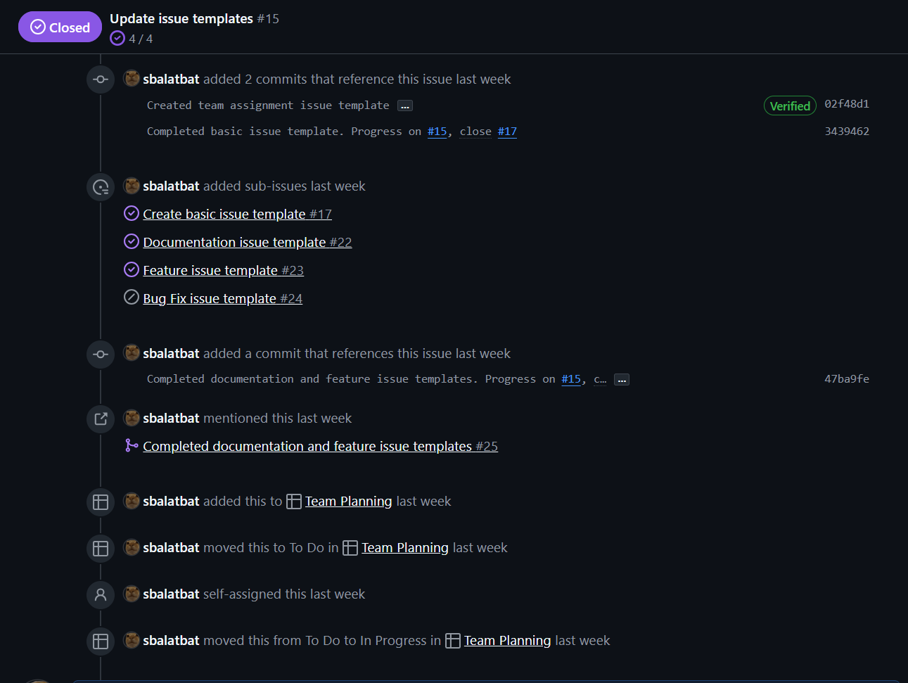

# cse110-sp25-group29
> *Soul source of truth for CSE110*

  [*About the Team*](https://cse110-sp25-group29.github.io/cse110-sp25-group29/admin/team.html)

## Quick Links
*See the Table of Contents at the top right corner for easier navigation.*

- Style Guide
- [Team Charter](https://github.com/cse110-sp25-group29/cse110-sp25-group29/blob/main/admin/misc/rules.md)
- [Project Board](https://github.com/orgs/cse110-sp25-group29/projects/2/)

## Directory Structure
```text
.github/ISSUE_TEMPLATE
admin/
├── adr/
├── branding/
├── meetings/
│   ├── img/
│   └── ui-ux/
│       └── images/
├── misc/
└── videos/
source/
└── assets/
    ├── icons/
    ├── images/
    ├── scripts/
    └── styles/
specs/
├── adrs/
├── brainstorm/
└── pitch/
```

### `admin`
*Contains most of the documentation related to the team.*

| Subdirectory | Contents |
| --- | --- |
| `adr` | warmup exercise document |
| `branding` | Boom Boom Powell team branding materials
| `meetings` | all meeting notes and materials |
| `meetings/img` | images for team meeting notes |
| `meetings/ui-ux` | UI/UX team meeting notes and materials |
| `meetings/ui-ux/img` | images for UI/UX team meeting notes |
| `misc` | team charter and member acknowledgements |
| `videos` | videos made for the team |

- `statusvideo1.mp4` has been uploaded to `/admin/videos/statusvideo1.mp4`. Also it's on [YouTube](https://www.youtube.com/watch?v=qB4SBX5r8Ps).

### `source`
*Contains the source code of the project. The top level holds the HTML files*

| Subdirectory | Contents |
| --- | --- |
| `assets` | all the peripherals to the HTML |
| `assets/icons` | image files for the user interface |
| `assets/images` | non-icon images |
| `assets/scripts` | JavaScript files |
| `assets/styles` | CSS files |

### `specs`
*Contains project documentation.*

| Subdirectory | Contents |
| --- | --- |
| `adrs` | Architectural Decision Records |
| `brainstorm` | materials from initial brainstorm sessions |
| `pitch` | materials for the initial product pitch |


## Roles

### UI/UX

*Create wireframes, architecture diagrams, user interface prototype designs, branding, and assets.*
- [Sarah Balatbat](https://github.com/orgs/cse110-sp25-group29/people/sbalatbat)
- [Aarav Vidhawan](https://github.com/orgs/cse110-sp25-group29/people/a-vidhawan)

[Figma Workspace](https://www.figma.com/design/F62JwC2QBMe2LE2tvJ8oQR/Concard?node-id=1-2&t=CcOyXVODIzJ4jH30-1) (Request access as needed)

### HOME PAGE

*Implement the landing home page and its functionalities including creating a new card and showing existing cards.*
- [Wanting Li](https://github.com/orgs/cse110-sp25-group29/people/alkane7)
- [Xiaogeng Xu](https://github.com/orgs/cse110-sp25-group29/people/OctFog)

### EDITOR PAGE

*Implement the editor page and its functionalities including creating a card from a template, creating a custom card with premade elements, and saving a card.*
- [Carl Ingelsson](https://github.com/orgs/cse110-sp25-group29/people/HugoIngelsson)
- [Jeffrey Yang](https://github.com/orgs/cse110-sp25-group29/people/jey013ucsd)
- [Joseph Kim](https://github.com/orgs/cse110-sp25-group29/people/jowiik)
- [Kian Maher](https://github.com/orgs/cse110-sp25-group29/people/kimaher)

### DEVOPS

*Create testing units and automation for quality assurance and conduct check-off reviews on pull requests.*

- [Vincent Gao](https://github.com/orgs/cse110-sp25-group29/people/Vincent-the-swimmer)
- [Brandon Khor](https://github.com/orgs/cse110-sp25-group29/people/brandonkhor)
- [Arnav Talreja](https://github.com/orgs/cse110-sp25-group29/people/ArnavTalreja)

## Definition of Done

- [ ] Pass HTML and CSS validators
- [ ] Pass end-to-end automation
- [ ] Follow the style guides
- [ ] Reviewed by group
- [ ] Checked off by DevOps
- [ ] Specified behaviors are met (*expand on this list per issue*)

## GitHub Usage

### Issues

When creating a new issue, make sure to adhere to the following:
- **Check the issues for duplicates.** Ensure we don't have duplicate issues by checking if someone has added them or something similar to them already.
- **Use the given templates!**
  - Documentation [DOCS]: Create or modify documentation.
  - Feature [FEAT]: Feature request or non-bug modifications/suggestions to source code.
  - Bug [BUG]: Report a non-intended behavior that needs attention.
- **Add the issue to the project board.** This can be updated on the sidebar of a pre-existing issue as well, along with a bulk update by selecting multiple issues at once and adding them to the project board.

- **Specify priority, size, and iteration.** These are all applicable only to issues on the project, so this hinges on adherence to the previous requirement. Iterations are based on the weeks we are actively working on this project. Read more on [priority](#priority) and [size](#size) below.
- **Add appropriate labels!** The descriptions of each label can be seen in the [labels page](https://github.com/cse110-sp25-group29/cse110-sp25-group29/labels).
- **Add the assignees.** If it is already known which people will be working on the issue, add them! If not, make sure to update them once they've been decided.
- **Be mindful of issue relationships.** Some issues are relevant to other issues, whether they are the "parent" of other issues, or they already have a "parent" issue. Connecting relevant issues helps us be aware of related problems that may affect each other.

#### Priority

*To be established.*

#### Size

*To be established.*

### Pull Requests & Merging

When opening a new issue, it is good practice to create a new branch dedicated for that issue. This way, we can take advantage of pull requests to minimize conflicts in development.

When committing to these branches, make sure to reference the issue you are working on using the issue number. GitHub uses [several keywords](https://docs.github.com/en/get-started/writing-on-github/working-with-advanced-formatting/using-keywords-in-issues-and-pull-requests) that can be used for *closing* issues, but it is also good to simply mention the issue number so that the commit can be included in that issue's history. See example below.


When you're done with your addition, commit to your branch, then create a pull request. This lets the team review your addition before approving the merge, minimizing conflicts and potentially buggy or unstyle code.

## Stand-Up Meetings & Procedures

As established in the team charter, each team is responsible for their exact schedules, but the rough schedule is as follows:
```
Monday:     Sub-Team Sprint Planning
Wednesday:  Sub-Team Stand-Up Meeting
Friday:     Sub-Team Sprint Review
Saturday:   Full-Team Review & Sprint Plan
```

When sending your stand-up check ins, please include:
- Priorities: What are the curent goals you are working on
- Progress: What you have done since the last stand-up
- Problems: What is blocking your progress

