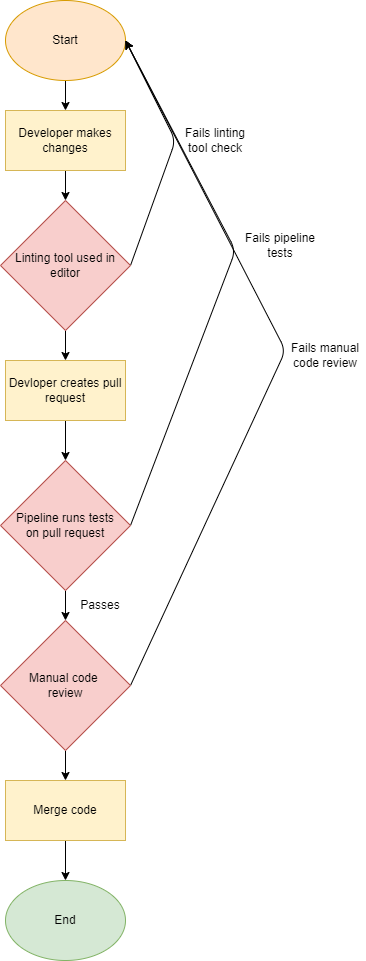

# Pipeline Overview

## Functional:
Currently, we have implemented two features of the pipeline. First, we are using Jest to do unit tests on function calls. As we don't have anything to test that is related to our project, we have created a filler function and filler tests to prove proof of concept. The function and tests are pulled from Lab 5. Next, we have implemented a style guide that should test the code for incorrect styling. This styling guide is implemented both at an editor level and within the pipeline to make sure code is styled correctly before merging with the main branch. Finally, once those two tests are passed, we have one final manual check. There will be someone who didn’t work on the pull request, who will be the last one to check the code and give the final approval before merging with the main branch. Once that approval has been given, the pull request is approved and merged with the main branch. Here is a current flowchart of the pipeline. 

## Future Plans:

We plan to have a code quality tool to give the developer a faster and rougher estimation of their code quality. The manual review will always be the final check, but in case it takes a while for someone to check the pull request, the code quality tool will give some feedback to the developer. We also don’t plan to have automatic documentation generation, as we believe doing the documentation manually will be much more accurate in the long run. Finally, the last thing we plan to add to the pipeline is to have E2E tests. For these tests to exist, there needs to be a stable interface that can be interacted with, and thus, we need a stable end product before we can start writing the tests. 
