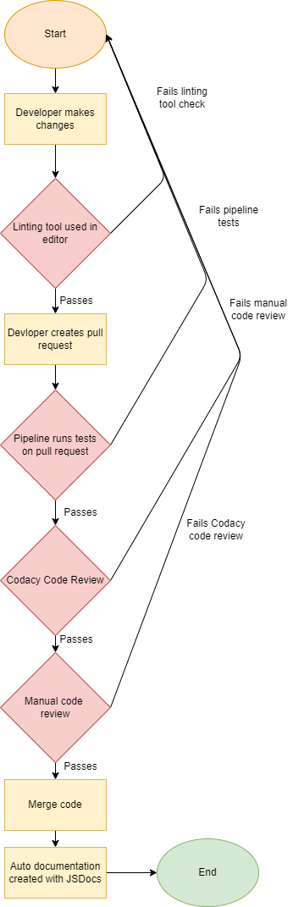

# Pipeline Overview

## Functional:
We have made three new changes to the pipeline. First, we updated the linter to an online one to simplify the linter a bit. This was changed due to a suggestion from the TA. The linter can also now be run within the editor to remove any styling issues before it is merged with the main branch. Second, we added Codacy as a bot code review as a secondary measure to keep the code consistent within the main repository. Finally, we added JSDocs for auto-documentation generation. We realized that the manual documentation generation we wanted was not feasible for a project of this scale and with a suggestion from a TA, we used JSDocs. Below is the updated pipeline with the new changes. 

## Future Plans:

The last thing we want to implement is E2E testing. As our build gets closer to a stable version, we feel more confident to start implementing E2E testing. The plan is to get that done this week and once that is completed, the pipeline will become stable for the most part. We will keep in contact with each team to make any changes needed, but other than that, we believe the pipeline should be finalized. 