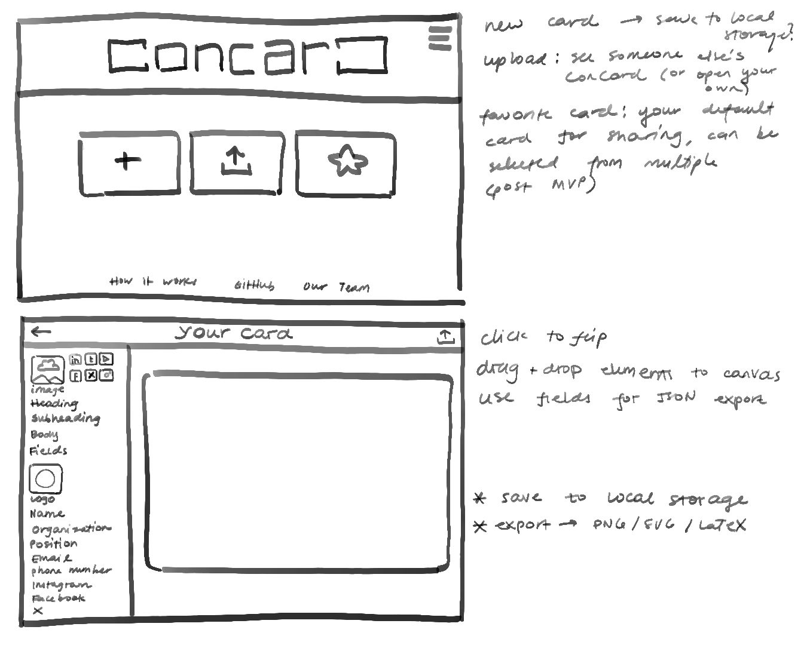

# UI/UX – Meeting 2  
**Date:** 05/12 | **Location:** Discord Call
**Time:** 6 : 06 pm – 6 : 55 pm

## Attendees  
Aarav, Sarah  

## Agenda
- First Sprint Planning – What do we want to accomplish this week?  
- Decide on a theme  
- Templates or not?  

---

## Notes  

### Another UI Draft
*(see sketch above)*  

### Sarah’s Idea for Modular “Modules”
- We already give the user the option to put modules like **“Logos”** and **“Heading”** onto their business cards.  
- Give the user the option to **create a custom set of modules** – e.g. *Logos + Headings*.  
- Allows the user to reuse the same set of modules without having to re‑format and arrange them each time.  
- **Example:**  
  > User creates a module called **“Project Exhibit”** – it has a logo, a heading, and two bullets for a project summary. Every time the user wants to add a project to the concard, they can select the *Project Exhibit* module they created and reuse it.

### Theme
- Spoke about it being **green and grey — Zen**.  
- **Green (Hex Code):** `#______`  
- **Grey (Hex Code):** `#______`  

### Logo
- Decided on a **link logo**, and the *C* and *D* design for main text on the landing page.

### Templates
- We think it’s best to have templates.  
- Blank canvas – user may not know where to get started.  
- **Template Ideas:**  
  1. *fill*  
  2. *fill*  
  3. *fill*  

---

### Goal This Week
- Finalize **theme** – colors and logo.  
- Finalize **landing page**.  
- Get feedback from teammates – treat them as the user (for now).  
