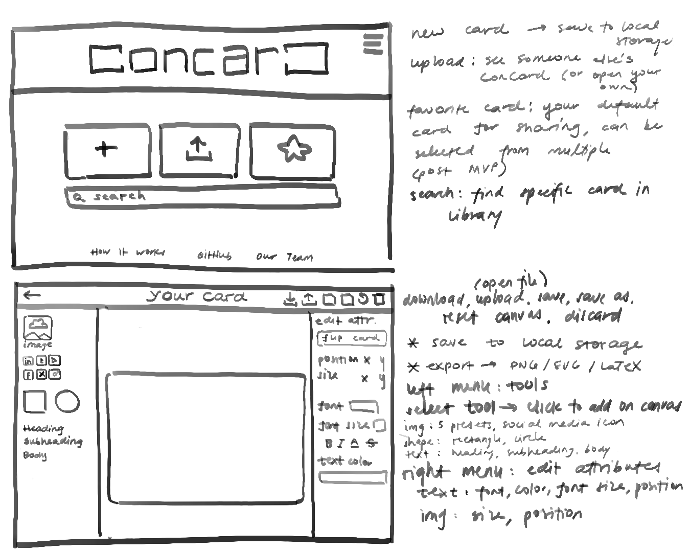
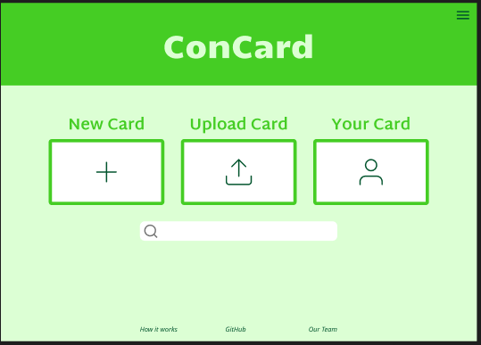
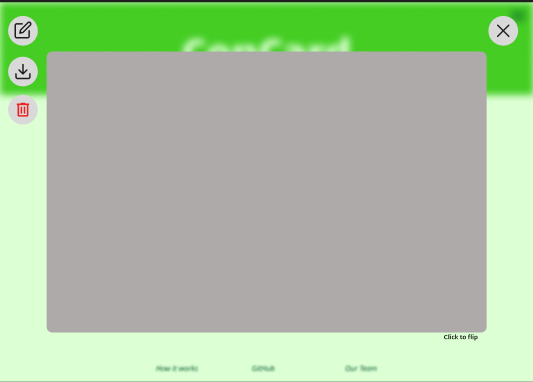
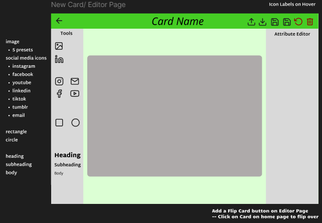
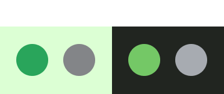
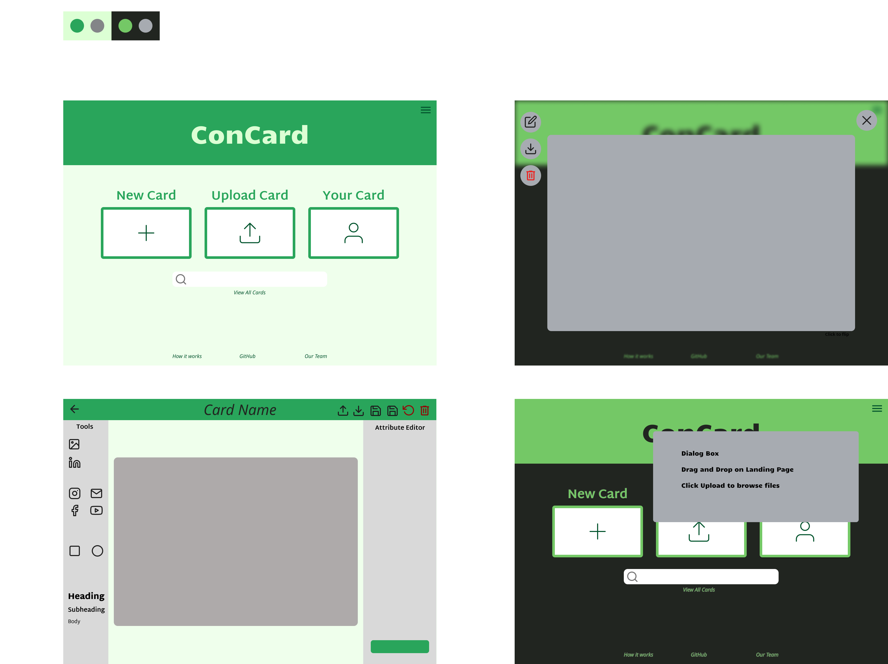

# Meeting Notes

Date: 05/16/2025 1:15pm-2:50pm

## Attendees

- Sarah
- Aarav

## Topics

- Finalize Home/Landing Page for the MVP
- Finalize (Roughly) Editor Page for MVP
- Decide on a Colour Scheme
- Sprint Review

## What Happened

### Prototyping
- Updated MVP wireframe sketch
  - Added search bar function
  - Added editor page sidebars

### Landing Page
- Discussed with Hugo: multiple cards is feasible -> We want a search bar on the home page.
- An iteration of the landing page from today

- An iteration of the "Your Card" view

  -  giving the user functions of "Edit", "Download", "Delete" to perform on the card
  -  Hover to show icon text
  -  Cross in the top right to go back to landing page
  -  The background is blurred when in this view

### Editor Page
- 2 sidebars instead of 1 — 1 for selecting modules(left) and 1 for attributes(right)

### Color Scheme
- 2 color schemes: 1 light, 1 dark

  - Light
    - Primary: 29A55B
    - Accent: 838588
    - Background: EFFFEC
  - Dark
    - Primary: 74C866
    - Accent: A7ABB1
    - Background: 212520

Wireframes with both colour schemes examples (top left — light) (bottom right — dark)

### Sprint Review
Progress from the past week's sprint
- Set up landing page layout
- Met with editor and home page teams to see what they’re doing and what we can implement on both
- Set up editor page layout
- Added some flows for your card, editor page, all cards etc.
- Set up colour/branding scheme
- Iterating on the logo — pretty much done at this point
- Sketch on all cards — designed next sprint

## Things to Do

- Get feedback from the team on the color schemes during team meeting
- Get approval for decisions
  - Color scheme
  - Add "All Cards" page
- Make ADRs for decisions
- Design All Cards view next sprint
- Communicate with Editor and Landing/Home Page teams on the current iterations of the designs to be implemented