_If you are looking for this application's documentation, please look [here](https://cse110-sp25-group29.github.io/cse110-sp25-group29/docs/index.html)_.

# Table of Contents
- [Table of Contents](#table-of-contents)
- [Introduction](#introduction)
- [How To](#how-to)
  - [Navigate ConCard](#navigate-concard)
    - [Home](#home)
      - [Site Theme](#site-theme)
      - [Search](#search)
      - [Buttons](#buttons)
    - [Gallery](#gallery)
      - [Navigation Bar](#navigation-bar)
      - [Cards](#cards)
      - [Card Viewer](#card-viewer)
    - [Editor](#editor)
      - [Canvas](#canvas)
      - [Navigation Bar](#navigation-bar-1)
      - [Toolbar](#toolbar)
  - [Create a new card](#create-a-new-card)
  - [Set your favorite card](#set-your-favorite-card)
  - [Manage your cards](#manage-your-cards)
  - [Export your cards](#export-your-cards)
  - [Upload your cards](#upload-your-cards)
- [Conclusion](#conclusion)
- [See Also](#see-also)

# Introduction

Hello! Welcome to **_ConCard_**, our hand-crafted card designer. We designed this software in consideration of those we thought would be swapping contacts very often, such as businessmen, fans, cosplayers, and so on -- basically keeping **con**ferences, **con**ventions, and **con**nections in mind. I'm sure you are excited to find out how to use our software, so let's dive right in!

# How To

## Navigate ConCard

Our program has three main pages: **Home**, **Gallery**, and our **Editor**.

### Home

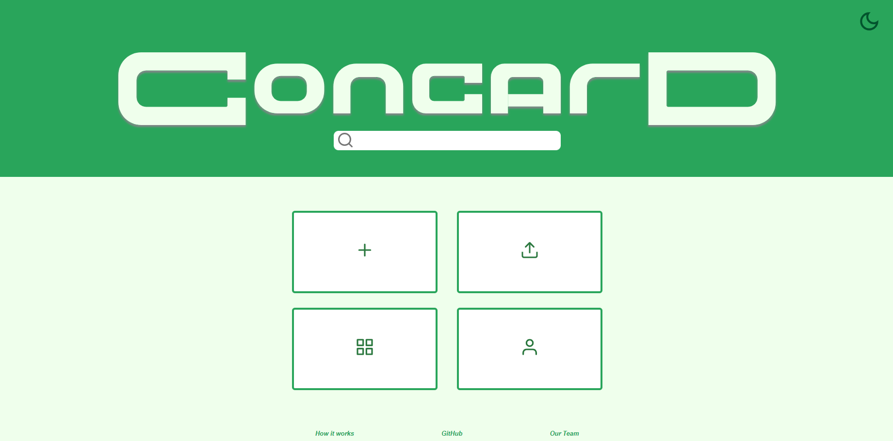

This is the first page you will see on our site. From here, you can create new cards, navigate to the gallery, and so on.

#### Site Theme

You can toggle the site's theme between light and dark using the icon on the **top-right corner** of the home page. Click the icon to toggle between themes. Toggling the theme to dark will change the moon icon to a sun icon, and vice versa.

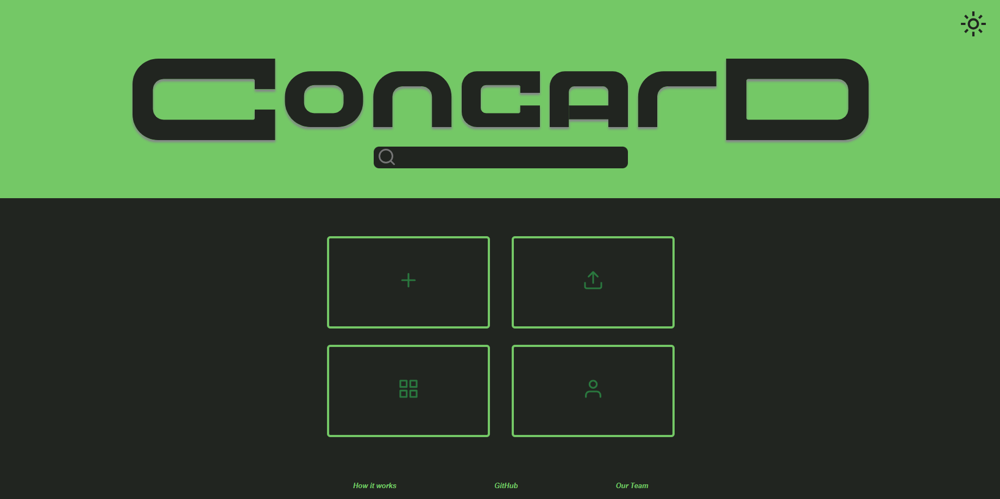

#### Search

Use the search bar to find cards by keywords in the title.
- A dropdown list will show all cards that contain the keyword.
- Clicking on a result takes you directly to the corresponding card in the editor.

#### Buttons

- **Create card**
  - This button is the **top-left** button on the main selection. Clicking this button will navigate you to our [Editor](#editor), creating a new untitled card.
  - See the ["Create a new card" section](#create-a-new-card) for more information on creating a new card.
- **Gallery**
  - This button is the **bottom-left** button on the main selection. Clicking this button will navigate you to our [Gallery](#gallery), where you can view the cards you have made and manage them.
  - _See the ["Manage your cards" section](#manage-your-cards) for more information on managing your cards._
- **Your Card**
  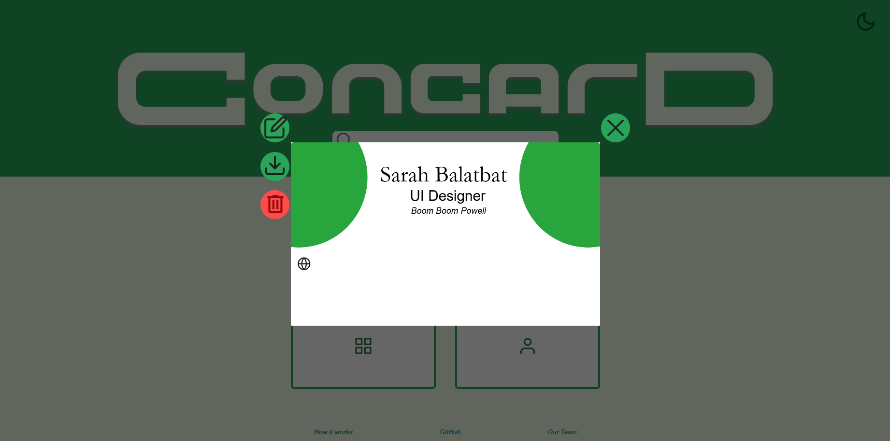
  - This button is the **bottom-right** button on the main selection. Clicking this button will let you view the card you have currently marked as your favorite. When you don't have one selected, you can select one from your gallery.
  - On this viewer, you can choose to edit, download, delete, or navigate away from your favorite card. You can also flip between the front and back sides of your card by clicking directly on the card.
  - _See the ["Set your favorite card" section](#set-your-favorite-card) for more information on setting your favorite card._
- **Upload card**
  - Last but not the least, this button is the **top-right** button on the main selection. Clicking this button prompts you to select a JSON file to upload as a new card.
  - _See the ["Upload your cards" section](#upload-your-cards) for more information on uploading your cards._

### Gallery

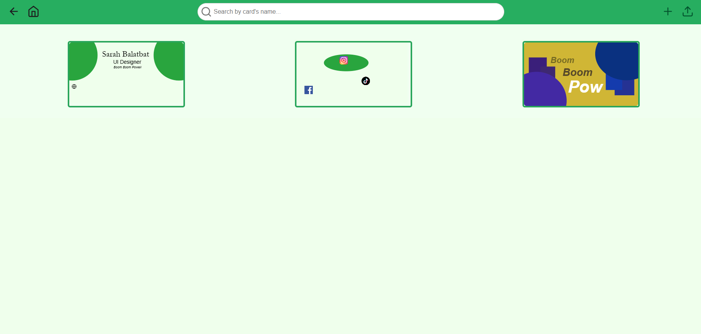

This is where you can view, search, and manage your cards.

#### Navigation Bar

The top, or navigation, bar contains some useful quick access points for you to use.

- **Back**
  - This is the arrow on the **top-left** corner of the page, which lets you navigate to the previous page you were just at. Functioning the same as browser's native back button, this is especially useful when you are in full screen mode and would like to return to your previous page.
- **Home**
  - This is the home icon right next to the back button, which takes you directly back to the [home](#home) page.
- **Search bar**
  - The search bar lets you enter keywords to search through the cards in your gallery.
  - A dropdown of results will generate as you type, and pressing `Enter` on your search render the matching cards in your gallery for easier browsing.
- **Upload**
  - The upload icon is on the **top-right** corner of the page, which lets you upload a JSON file as a new card into the gallery.
  - _See the ["Upload your cards" section](#upload-your-cards) for more information on uploading your cards._

#### Cards

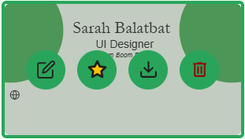

Hovering your mouse on one of your cards will show some useful functions you can use. From left to right, each is explained as the following:
- **Edit**
  - Clicking this icon will open the card you are hovering on in the [editor](#editor).
- **Favorite**
  - Clicking this icon will toggle the card you are hovering on as your favorite card.
  - _See the ["Set your favorite card" section](#set-your-favorite-card) for more information on setting your favorite card._
- **Download**
  - Clicking this icon will download the card you are hovering on as a JSON file into your computer.
  - _See the ["Export your cards" section](#export-your-cards) for more information on downloading your cards._
- **Delete**
  - Clicking this icon will delete the card you are hovering on. **This is not reversible**. You will be asked to confirm before deleting, and once you click confirm, the card will be removed from your gallery.

#### Card Viewer

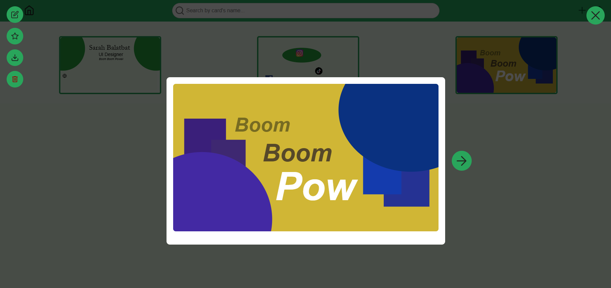

When you click on a card, the card viewer opens. This lets you preview your cards and manage them.

On the left side, you can do the following, from top to bottom:
- **Edit**
  - Clicking this icon will open the card you are hovering on in the [editor](#editor).
- **Favorite**
  - Clicking this icon will toggle the card you are hovering on as your favorite card.
  - _See the ["Set your favorite card" section](#set-your-favorite-card) for more information on setting your favorite card._
- **Download**
  - Clicking this icon will download the card you are hovering on as a JSON file into your computer.
  - _See the ["Export your cards" section](#export-your-cards) for more information on downloading your cards._
- **Delete**
  - Clicking this icon will delete the card you are hovering on. **This is not reversible**. You will be asked to confirm before deleting, and once you click confirm, the card will be removed from your gallery.

You can also see an **arrow** button on the side of the card preview. This lets you swap between viewing the front and back sides of your card.

### Editor

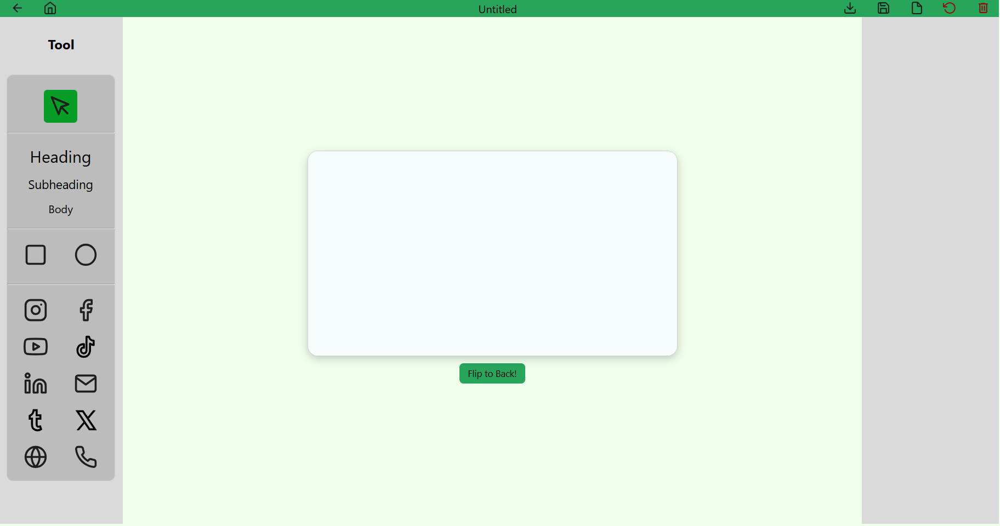

This is the star of the show, one our devs are definitely proud of implementing. Here, you can let your creative spirit free to design your cards as you desire.

#### Canvas

The canvas is the central field of focus, where your imagination can enjoy itself. _As of June 9th, 2025, it is currently sized as 1080 x 600, but we hope to make it customizable in the future_.

#### Navigation Bar

The top, or navigation, bar contains most file management functions as well as navigation functions for the editor.

- **Back**
  - This is the arrow on the **top-left** corner of the page, which lets you navigate to the previous page you were just at. Functioning the same as browser's native back button, this is especially useful when you are in full screen mode and would like to return to your previous page.
- **Home**
  - This is the home icon right next to the back button, which takes you directly back to the [home](#home) page.
- **Title**
  - The text field in the very middle of the navigation bar is for the **title** of the card you are currently using.
  - The title will be in **bold**, with an asterisk, to indicate that there are currently unsaved changes to the card.
- **Download**
  - The **download** button is to the right of the **title**, which lets you export your card and save it as one of three file types: JSON, PNG, and JPG.
  - _See the ["Export your cards" section](#export-your-cards) for more information on downloading your cards._
- **Save**
  - The **save** button is to the right of the **download** button. Clicking the **save** button will save your current progress on your card to your browser.
  - Upon hovering over the **save** button, "Save as" will show as an option, which lets you save the current card under a different name. This will create a copy of your current card under the same name, and is what you will keep editing after saving.
- **File**
  - The **file** button is to the right of the **save** button, and provides the following choices: Open, New, and Duplicate. **Make sure to save any unsaved changes before proceeding with these options.**
    - Open - This allows you to open one of your saved cards using the dropdown menu.
      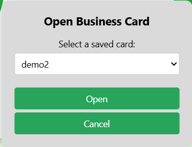
    - New - This opens a new untitled card in your current editor.
    - Duplicate - This opens a duplicate of what you were just working on, named "Copy of \[current card\]".
- **Reset**
  - The **reset** button is to the right of the **file** button, which discards all unsaved changes. **This is not reversible.**
- **Delete**
  - Lastly, the **delete** button is on the **top-right** corner of the page. Clicking this will ask for you to confirm the deletion of the card. **Deletion is not reversible.**

#### Toolbar

The left side of the page is the toolbar, which contains the following tools you can use, from top to bottom:
- Selector
  - This is the **arrow** icon at the top of the toolbar. This is the default tool, which lets you select the different elements you have added onto the canvas.
  - Selecting an element will open its respective attribute editor, where you can change certain attributes based on the element selected.
- Text
  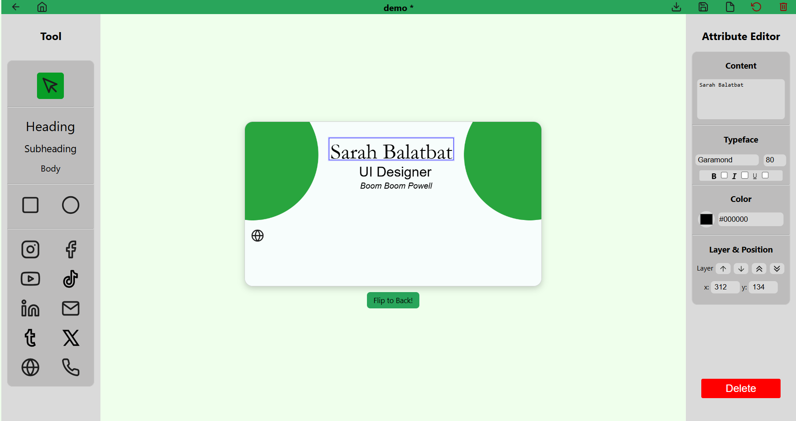
  - The text tool has three presets: **Heading**, **Subheading**, and **Body**. These presets have different sizes, for your convenience with creating you card. You can change your text attributes using its respective attribute editor on the right hand side of the screen
  - Attributes:
    - Content - This lets you change the content of your text element. Just type to edit the field, and the text element will match its contents.
    - Typeface - Under this section, you can change the font and font size of your text, as well as add formatting, such as **bold**, *italic*, and <u>underline</u> to your text.
    - Color
      - Clicking on the color square will open the color picker, which lets you pick a custom color within the RGB color space.
      - The color picker interface also allows you to use the color drop tool, which lets you select a color from anywhere on your screen that your cursor can reach.
      - Lastly, you can also enter a color in hexadecimal using the color field.
    - Layer & Position
      - Layer - The first two up & down arrows moves the selected element up or down in the layer stack. The last two up & down arrows moves the selected element to the top or the bottom of the layer stack, respectively.
      - Position - You can fine tune the position of your element by changing the x and y coordinates provided. The elements are anchored on the top-left corner, relative to the top-left corner of the canvas.
- Shape
  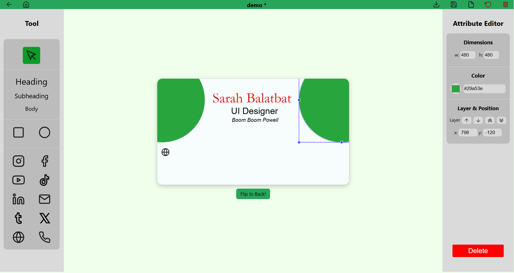
  - The shape tool has two shapes: **rectangle** and **ellipse** / **circle**.
  - Attributes:
    - Dimensions - You can fine tune the width and height of your shape using the x and y dimensions. If you want to create a shape with the same x and y dimensions, hold down your `Shift` key while dragging one of the anchor points of the shape on the canvas.
    - Color - Just like the text, you can adjust the color of your shape.
      - Clicking on the color square will open the color picker, which lets you pick a custom color within the RGB color space.
      - The color picker interface also allows you to use the color drop tool, which lets you select a color from anywhere on your screen that your cursor can reach.
      - Lastly, you can also enter a color in hexadecimal using the color field.
    - Layer & Position
      - Layer - The first two up & down arrows moves the selected element up or down in the layer stack. The last two up & down arrows moves the selected element to the top or the bottom of the layer stack, respectively.
      - Position - You can fine tune the position of your element by changing the x and y coordinates provided. The elements are anchored on the top-left corner, relative to the top-left corner of the canvas.
- Icon
  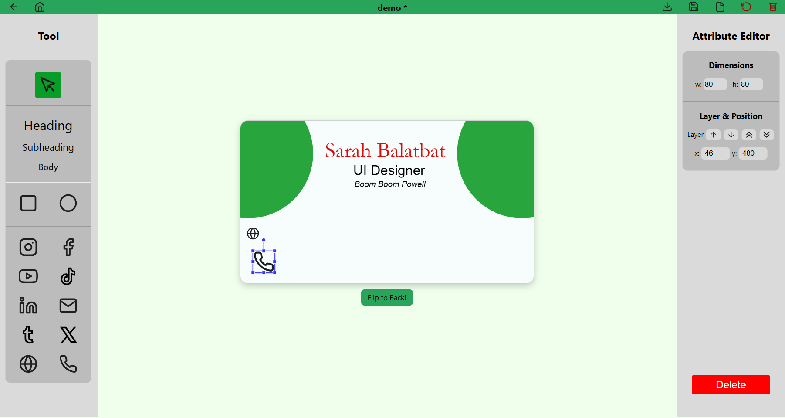
  - The icon or image tool has 10 presets to pick from for easy contact information sharing: Social media platforms such as **Instagram**, **Facebook**, **YouTube**, **TikTok**, **LinkedIn**, **Tumblr**, and **X (Twitter)**; as well as general contact information such as **Email**, **Website**, and **Phone**.
  - *As of June 9th, 2025, we currently cannot support custom image upload but we hope to have this implemented in the near future.*
  - Attributes
    - Dimensions - You can fine tune the width and height of your icon using the x and y dimensions. If you want to create a shape with the same x and y dimensions, hold down your `Shift` key while dragging one of the anchor points of the shape on the canvas.
    - Layer & Position
      - Layer - The first two up & down arrows moves the selected element up or down in the layer stack. The last two up & down arrows moves the selected element to the top or the bottom of the layer stack, respectively.
      - Position - You can fine tune the position of your element by changing the x and y coordinates provided. The elements are anchored on the top-left corner, relative to the top-left corner of the canvas.

_For information on the keyboard shortcuts in the editor, please view [here](https://cse110-sp25-group29.github.io/cse110-sp25-group29/docs/keyboard-shortcuts.html)._

## Create a new card

Here are three ways you can create a new card.

1. Home - On the main selection, click the **Create new** button. This will navigate you to the editor and create a new untitled card.
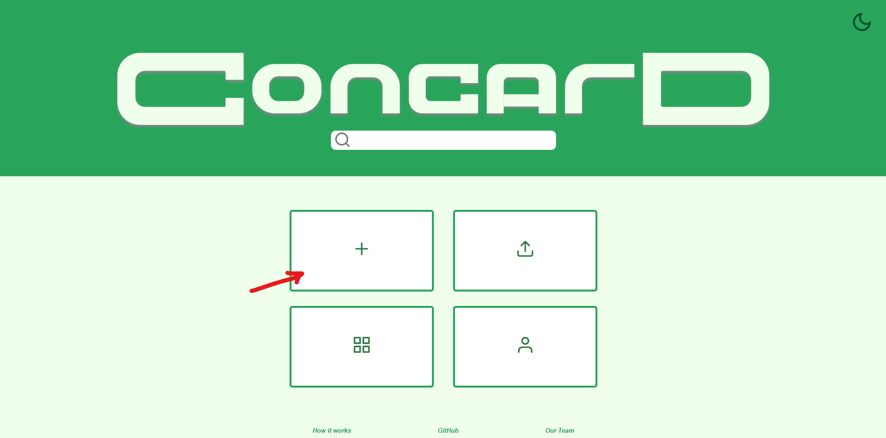
2. Gallery - On the navigation bar, click the "plus" (+) icon near the top right of the page.

3. Editor - On the navigation bar, hover over the "file" icon near the top right of the page, and click "New".  
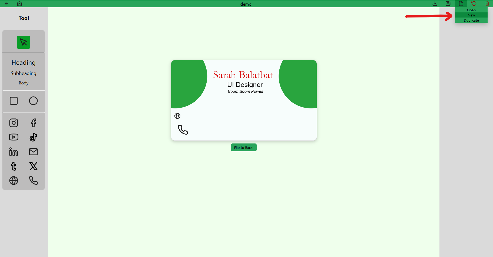 
   - _You can also create duplicate cards by clicking the "Duplicate" option instead._

## Set your favorite card

You can set your favorite card in the gallery. If you have one already marked as your favorite, it will be the first card in your gallery, and hovering over it will show that the star is gold to indicate its favorite status. There is only one favorite card, so marking another card as favorite will remove the previously marked card.

1. Hover options - Hover your mouse on the card you would like to set as your favorite. Click the "star" icon to toggle.
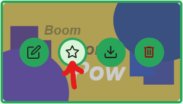
3. Card preview - Click the "star" icon near the top left of the card preview to toggle.
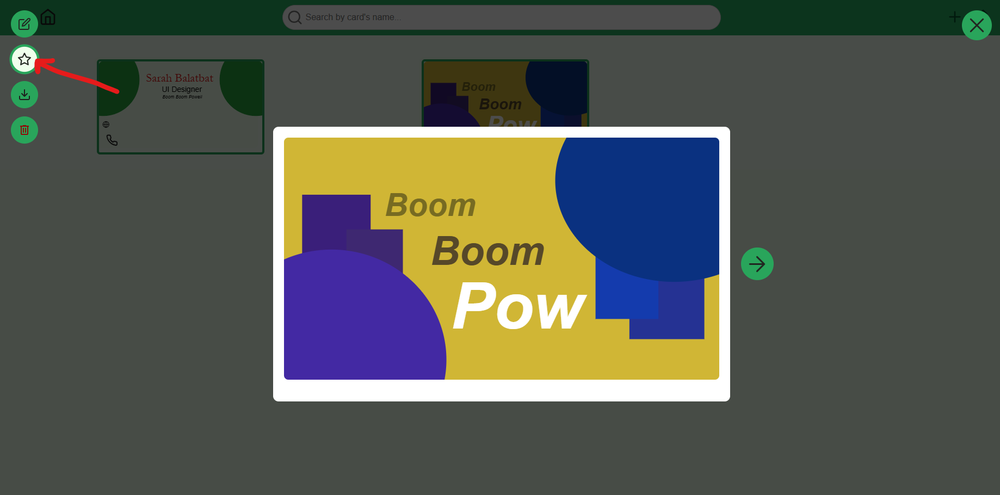

## Manage your cards

To manage your cards, navigate to the [gallery](#gallery) by clicking the gallery button on the home page.
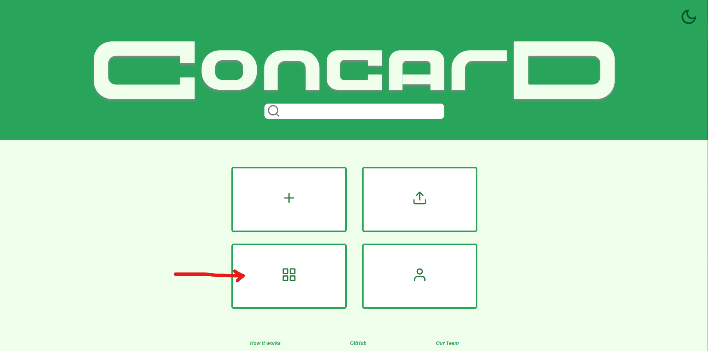

From here, you can browse, search, edit, favorite, download, and delete your cards.

## Export your cards

Supported export filetypes:
- JSON - This is a custom ConCard JSON file.
- PNG - Lossless high-quality image of your card.
- JPG - Lossy compressed image of your card perfect for websites.

You can export your cards through the following:
- Home page "Your Card" viewer as a JSON
- Gallery card hover options and card preview options as a JSON
- Editor as JSON, PNG, or JPG

## Upload your cards

- Click the "Upload" button on the main selection of the home page OR the navigation bar on the gallery to open the upload dialog.
  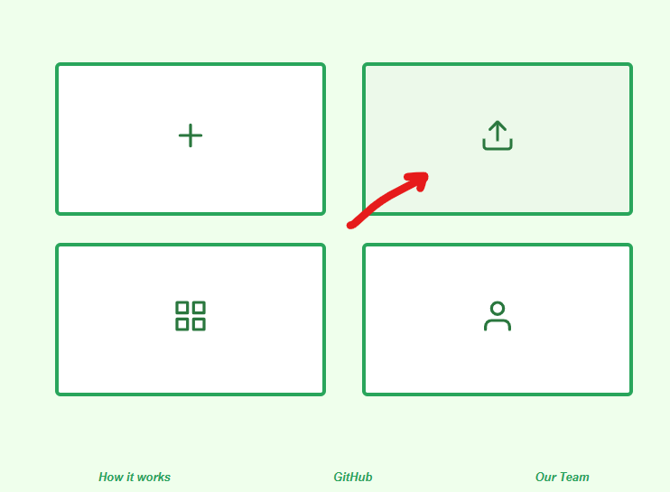
  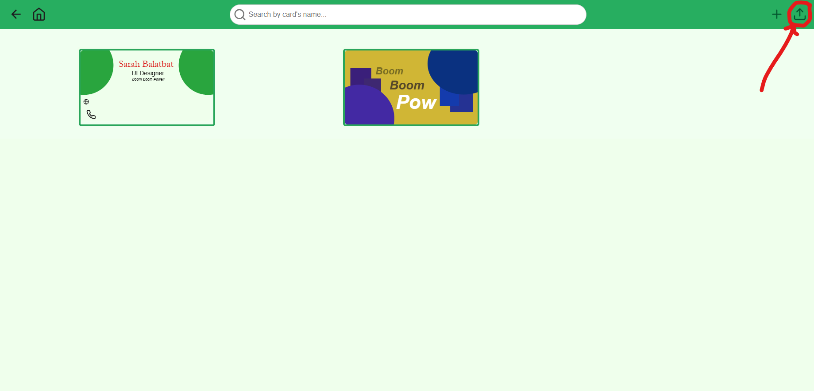
- You can either:
  
  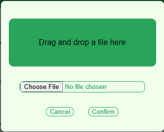
  - Select a file from your computer.
  - Drag and drop a file into the dialog area.
- The "Confirm" button remains disabled until a valid file is selected or dropped.
- To close the dialog:
  - Click the "Cancel" button, or
  - Click on the overlay background.

**_ConCard_ will only accept valid JSON files for upload.**

# Conclusion

We hope that this guide makes it clear how to use our program. Thank you for trying out our software!

# See Also

Feel free to also check out the following :\) Happy creating!

- [ConCard Repository](https://github.com/cse110-sp25-group29/cse110-sp25-group29)
- [About our Team](https://cse110-sp25-group29.github.io/cse110-sp25-group29/admin/team.html)
- [Keyboard Shortcuts](https://cse110-sp25-group29.github.io/cse110-sp25-group29/docs/keyboard-shortcuts.html)