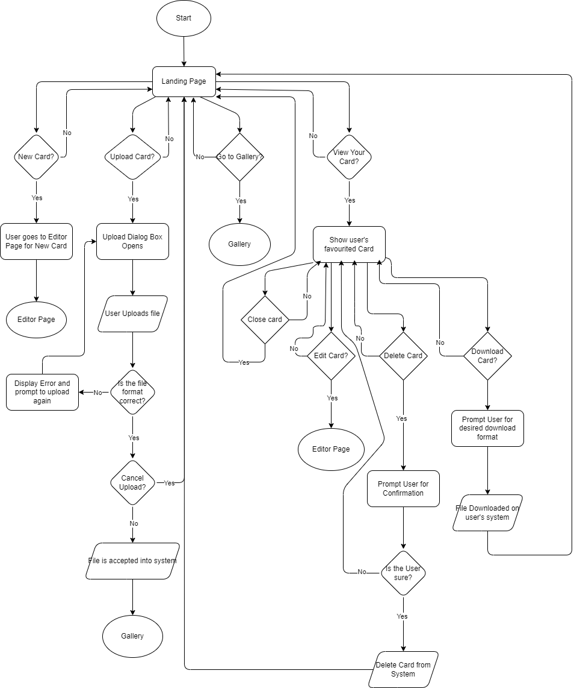
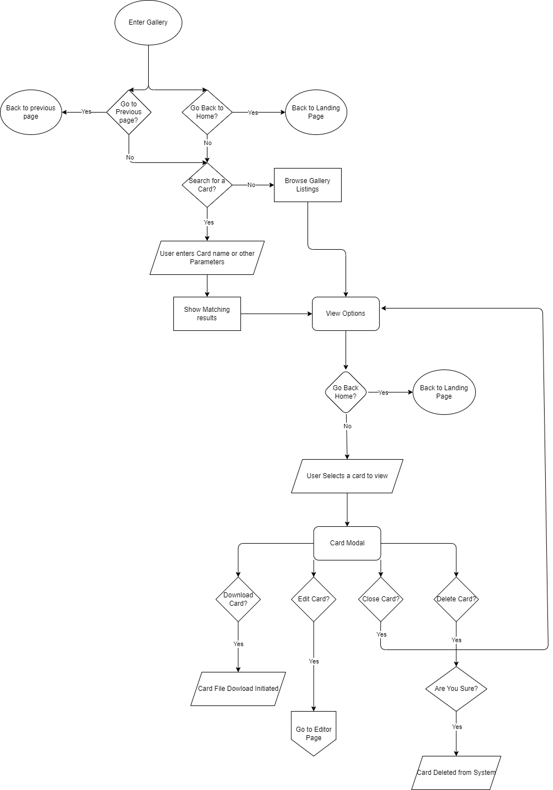
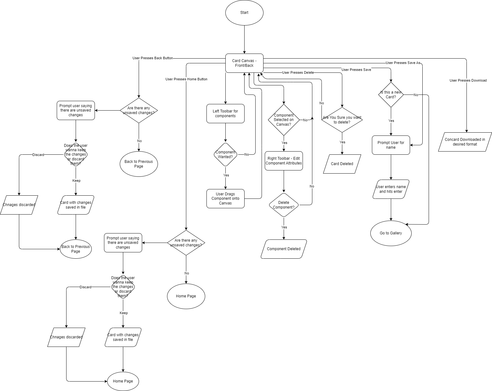

# ConCard — UI/UX Documentation
[*link to Figma Workspace*](https://www.figma.com/design/F62JwC2QBMe2LE2tvJ8oQR/Concard?node-id=2-2&p=f&t=I3SgONGAcdSqAx7h-0)
## 1. Brand Theme and Palette

We initially wanted to create a social media like application with business cards. They'd be like mini resumes and a way for you to **connect** with people you meet in **conferences**, or other places. That's where we got **Concard** form initially, and decided to go with a _**Zen**_ theme. Hence the green and grey combinations.

| Theme  | Role       | Hex     |
|--------|------------|---------|
| **Light** | Primary   | `#29A55B` |
|          | Secondary  | `#838588` |
|          | Tertiary   | `#BDBCBC` |
|          | Background | `#EFFFFC` |
| **Dark** | Primary    | `#74C866` |
|          | Secondary  | `#A7ABB1` |
|          | Tertiary   | `#2E302D` |
|          | Background | `#212520` |

**Red** : `#CD2424`

*Primary green drives actions; red is reserved for destructive buttons only.*

---

## 2. Key Screens 
*(exported wireframes live in repo → `/specs/wireframes/`)*
| **Editor**  | Left toolbar = components. Canvas in middle. Right panel = Attribute Editor. |

### Landing Page

 

Above you can see both the light and dark theme for the landing page. It contains 4 buttons (_by row column_): **New Card**, **Upload Card**, **Open Gallery**, **Your Card**. It also has a search bar that lets you search through the cards in your gallery, and view matching results.

Some footer links are also present that leas to the **How it Works** documentation page, and some team GitHub links

The goal was to keep the landing page simple, and intuitive whihc is why we decided on going with this symmetric 2x2 layout for buttons. The figma workspace can be visited to see progression of our landing page.

### Gallery
 

Here you can see 2 views of the Gallery page, one with the 'on-hover' menu and one without.

On the top bar as well, you see navigation buttons on the left and card functionlity on the right, allowing the user to create a new card or upload one in this screen as well.

You can also "favourite" a card -- by selecting the star on hover -- which then becomns **Your Card** and is the one shown on the home screen.

### Editor Page

Here you can see 2 variants of the editor page, for Text and for Shapes.

The Attribute Editor is blank until a component is selected, and turns into the correct variant accoridng to the component. 

The top toolbar also contains functions to export, save, upload, reset and delete a card. 

The goal was to create an Editor Page that was intuititive to use, and gave the user access to all essential functions at all times.

---

## 3. Core User Flows  
*(PNG flowcharts live in repo → `/specs/flows/`)*
1. **Landing Page Flow** – `landing-page-flow.png`  

2. **Gallery Flow** – `gallery-flow.png`  

3. **Editor Flow** – `editor-page-flow.png`

Each chart shows prompts for unsaved changes, delete confirmations, and navigation back‑stops. Follow them exactly to match UX copy and decision points.

> Avoided going into each and every component and it's sub-decisions on the editor page due to high complexity and the time constraint. We wanted the main flows to be clear and concise. A future addition should be more specific and detailed flows.

---

## 4. Components & Variants  
All components sit in Figma page **02‑Assets**.  They are named like `Toolbar - Text - Light` so you can swap themes instantly via Variants.

> The process is to make all changes to/create new variants when necessary, and use variants to "piece together" desired wireframes. Allows modularity and uniformity across designs.
>
> Also makes it easier to build upon our existing Figma designs.

---

## 5. Quick Figma Usage Notes
* Use the 8‑pt grid; snap icons & buttons accordingly.
* Colours come from the table in §1—**never** hard‑code hex.
* Always modify **variants** and use them to put otgether new prototypes for page variants or new pages.
* Export Icons as `SVG`s as they scale better.

---
